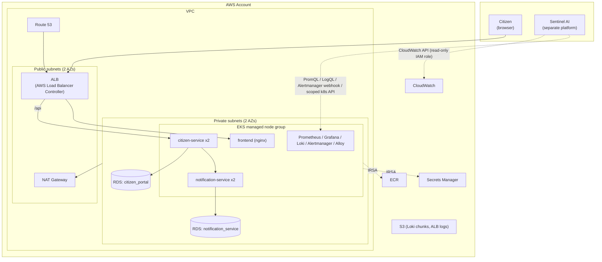

# AWS Deployment Architecture

How this project's existing `k8s/` manifests map onto AWS, and what actually changes to get
there. Written against the state of the project as of Phase 12 — everything in `k8s/` today
targets a local cluster (kind/minikube/Docker Desktop); this document is the plan for a real
target, not something that's been applied yet.

> Same honesty standard as the rest of this project: nothing in this document has been deployed
> to a real AWS account. It's a reviewed design, cross-checked against the actual manifests in
> `k8s/`, not a guess.

## Why EKS, not a rebuild

Every application-layer manifest in `k8s/` — Deployments, Services, ConfigMaps, the Ingress
resource shape, the Prometheus/Grafana/Loki/Alertmanager stack — is already plain Kubernetes with
no cluster-specific assumptions baked in beyond storage class names and the Ingress class. EKS is
the target that requires the least rework: swap the storage class, swap the Ingress controller,
point `DATABASE_HOST` at a managed endpoint instead of an in-cluster Service, and everything else
`kubectl apply -k k8s/` already does keeps working as-is.

## Service mapping

| This project today (`k8s/`) | On AWS | What changes |
|---|---|---|
| `postgres/`, `notification-postgres/` (Deployment + PVC) | **Amazon RDS for PostgreSQL** — two instances, one per service, same "one DB per microservice" boundary Phase 2 established | `DATABASE_HOST` in each service's ConfigMap becomes the RDS endpoint; the `postgres`/`notification-postgres` Deployment, Service, and PVC manifests are simply not included in the AWS overlay |
| `citizen-service/`, `notification-service/`, `frontend/` (Deployments) | **EKS managed node group**, unchanged Deployments | Storage class only affects `citizen-service`'s upload PVC (see below) — the app containers themselves don't change |
| `citizen-service/pvc.yaml` (uploads) | **EBS via the `gp3` CSI storage class**, or **S3** if the upload feature ever moves off local-disk | `StorageClass: gp3` instead of the default local-path class kind/minikube provide |
| `ingress/ingress.yaml` (`ingressClassName: nginx`) | **AWS Load Balancer Controller**, `ingressClassName: alb`, provisions an ALB | This is also the ingress-nginx migration Phase 8 and Phase 11 both flagged and deferred — moving to AWS is a natural point to finally do it, since ALB is the more AWS-native choice anyway, not a detour |
| GHCR (`ghcr.io/<owner>/citizen-portal-*`, Phase 11) | **Amazon ECR**, or keep GHCR | Either works — EKS nodes can pull from GHCR with an `imagePullSecret` same as any registry. ECR's advantage is IAM-based pulls via each node's instance role, no pull secret to manage at all. Recommended, not required. |
| `k8s/*/secret.yaml` (plaintext `stringData`, demo-only values) | **AWS Secrets Manager** + **External Secrets Operator** | Directly closes the gap Phase 11 flagged ("No real secret management") — `ExternalSecret` resources replace the static `Secret` manifests, syncing from Secrets Manager instead of committing values to the repo |
| No DNS/TLS today (`citizen-portal.local` via `/etc/hosts`) | **Route 53** + **ACM**, TLS terminated at the ALB | New — nothing to migrate, this simply doesn't exist locally |
| `k8s/monitoring/prometheus/`, `grafana/`, `loki/`, `alertmanager/` (Phase 9) | Two viable options — see below | |

### Observability: two options, not one obvious answer

**Option A — keep it exactly as-is.** Everything in `k8s/monitoring/` is already plain Kubernetes
manifests with no cloud dependency; it runs on EKS unmodified except for one real gap Phase 9
already flagged: Loki's `emptyDir` storage is fine for a local demo but wrong for anything meant
to persist. Loki supports an S3 storage backend directly — swapping Loki's config to write to a
dedicated S3 bucket instead of `emptyDir` closes that gap without adopting anything new.

**Option B — Amazon Managed Prometheus (AMP) + Amazon Managed Grafana (AMG).** Trades operating
Prometheus/Grafana yourself for a managed service with native IAM/SigV4 authentication — which
matters directly for the Sentinel integration (see `docs/sentinel-integration.md`): Sentinel
querying AMP means one IAM policy, no in-cluster network path or port-forward for it to depend
on. The in-cluster Prometheus would then `remote_write` to AMP instead of serving its own
long-term storage; Grafana Alloy's log path to Loki is unaffected either way.

This document doesn't pick one — it's a real tradeoff (ops burden vs. a new managed-service
dependency and its own cost), not something to default on without deciding it deliberately, same
posture the rest of this project has taken on similar forks (see Phase 9's Alloy-vs-Promtail
finding, Phase 11's trivy-action finding).

## Networking

- **Two public subnets** (one per AZ, minimum for an ALB) hold only the ALB and NAT Gateway — no
  application pods run here.
- **Two private subnets** hold the EKS node group and both RDS instances. Nodes reach the
  internet (image pulls, external calls) only through the NAT Gateway; nothing inbound reaches a
  pod except through the ALB.
- `notification-service` still has **no Ingress rule** — same server-to-server-only boundary
  Phase 7 established, unchanged by the move to AWS.
- **IRSA** (IAM Roles for Service Accounts) replaces the informal "the app just has these env
  vars" trust model for anything that needs to call an AWS API directly — the ExternalSecrets
  controller's pod gets a role scoped to `secretsmanager:GetSecretValue` on exactly the secrets
  it needs, nothing broader.

## Sizing — demo posture vs. production posture

This is a demonstration project; default to the cheaper posture and note explicitly where a real
production deployment would differ, rather than silently sizing for one or the other:

| | Demo (default) | Production posture |
|---|---|---|
| NAT Gateway | 1, single-AZ | 1 per AZ (avoids a single point of failure for all outbound traffic) |
| EKS node group | 2x `t3.medium`, no autoscaling | Cluster Autoscaler or Karpenter, sized to actual load |
| RDS | `db.t3.micro`, single-AZ, no read replica | Multi-AZ (automatic failover), read replica if read load justifies it |
| Backups | RDS automated backups, 1-day retention | Longer retention, tested restore procedure, cross-region snapshot copy |

## Migration path

1. **Add a Kustomize overlay**, `k8s/overlays/aws/`, rather than editing the base manifests in
   place — the base stays cluster-agnostic and keeps working for local kind/minikube/Docker
   Desktop use exactly as it does today (Phases 7 and 8 remain valid on their own). The overlay:
   - Patches `citizen-service`/`notification-service` ConfigMaps' `DATABASE_HOST` to the RDS
     endpoints
   - Omits `postgres/` and `notification-postgres/` entirely
   - Adds `ExternalSecret` resources in place of the static `Secret` manifests
   - Replaces `ingress/ingress.yaml`'s `ingressClassName` with `alb` and adds the AWS Load
     Balancer Controller's required annotations (`alb.ingress.kubernetes.io/scheme`,
     target-type, etc.)
   - Sets the upload PVC's `storageClassName` to `gp3`
2. **Provision the account-level infrastructure** (VPC, EKS cluster, RDS instances, ECR
   repositories, the Secrets Manager entries the ExternalSecrets reference) — Terraform is the
   natural fit given the DevOps stack this whole project was built to demonstrate, kept in a new
   top-level `infra/` directory, not mixed into `k8s/`.
3. **Extend `.github/workflows/ci-cd.yml`** (Phase 11) with a `deploy` job, gated on
   `build-and-push-images` succeeding, authenticating to AWS via **OIDC federation** (GitHub
   Actions' native `id-token: write` permission assuming an IAM role — no long-lived AWS access
   keys stored as GitHub secrets), running `aws eks update-kubeconfig` then
   `kubectl apply -k k8s/overlays/aws/`. Phase 11 deliberately stopped short of this because there
   was no real target to deploy to yet — this is that target.
4. **Point Route 53 + ACM at the ALB**, replacing the `citizen-portal.local` `/etc/hosts` entry
   every local deploy script currently prints instructions for.
5. **Run `scripts/smoke-test.sh` and `scripts/incident-scenarios.sh` (Phase 12) against the real
   URL** before calling the migration done — the same verification discipline every prior phase
   used before being marked `[x]`, not skipped just because the target changed.

## What this document deliberately doesn't cover

- Multi-account / multi-environment (dev/staging/prod) AWS organization structure — this project
  has one environment today; that's a real decision to make once there's a second one to isolate
  from the first.
- Disaster recovery / cross-region failover — out of scope until there's a stated availability
  target to design against.
- Cost estimates in dollar figures — instance types and counts are given so an estimate can be
  built from current AWS pricing at deployment time, rather than quoting numbers here that go
  stale immediately.
