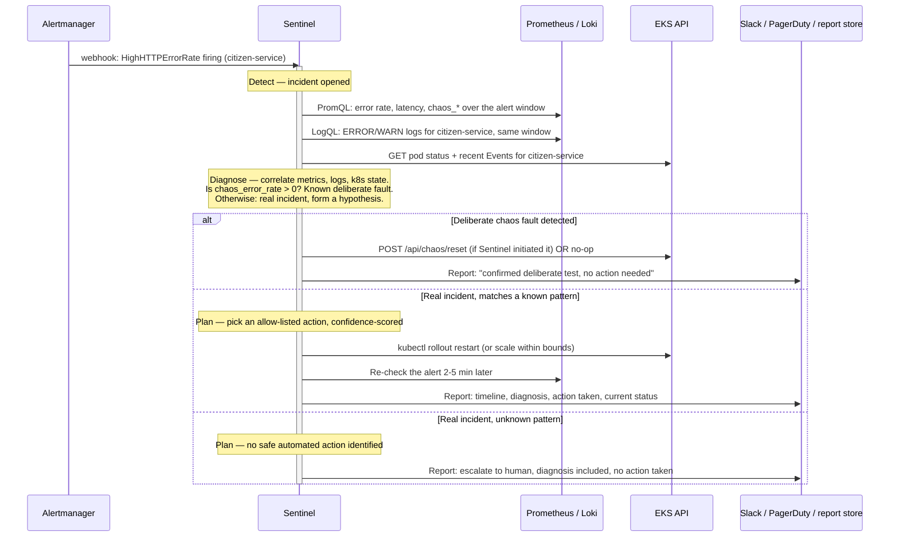

# Sentinel AI Integration

Sentinel AI is a separate autonomous SRE platform, built in its own repository. This project
exists to be its **sample production workload** — every observability building block in Phases
6, 9, and 10 (structured logs with `request_id` correlation, Prometheus metrics, Alertmanager
alerts, a controllable chaos surface) was put there specifically so Sentinel has something real
to detect, diagnose, and act on, rather than a toy metric fabricated for a demo.

This document describes the **interface contract** this project exposes — what Sentinel can read,
what it can (carefully) act on, and how those signals are meant to compose into a full incident
lifecycle. It does not describe Sentinel's own internals; those live in Sentinel's repository.
Nothing here has been wired up against a running Sentinel instance yet — this is the contract
both sides are meant to build to.

## What Sentinel can read

| Signal | Where | Access pattern |
|---|---|---|
| Metrics | Prometheus (in-cluster, Phase 9) or Amazon Managed Prometheus if that option is taken (see `docs/aws-deployment.md`) | PromQL over HTTP, or AMP's SigV4-authenticated query API |
| Logs | Loki (Phase 9), structured JSON with `request_id`, `level`, `service` labels (Phase 6) | LogQL over HTTP |
| Alerts (push, real-time) | Alertmanager webhook receiver | Alertmanager `POST`s to a URL Sentinel exposes — this is the primary "wake up" signal, not polling |
| Kubernetes state | EKS API server | A scoped `ServiceAccount` + `Role` (namespace-limited, not `ClusterRole`), IRSA-bound if Sentinel itself runs as an EKS workload |
| AWS-level signals | CloudWatch (ALB target health/5xx, RDS CPU/connections, EKS control plane) | CloudWatch API via a read-only IAM role |
| Deliberate chaos state | `chaos_*` Prometheus metrics (Phase 10): `chaos_latency_ms`, `chaos_error_rate`, `chaos_db_failure`, `chaos_notification_failure_rate`, `chaos_injections_total` | Same PromQL path as any other metric — see "Chaos-awareness" below for why this matters specifically |

`request_id` is the thread that ties a lot of this together: it's generated per-request in
`citizen-service`'s middleware (Phase 6), attached to every log line for that request, and is the
key that lets a spike in `HighHTTPErrorRate` get correlated back to the specific log lines — and
from there the specific citizen action — that caused it, instead of Sentinel only ever seeing
aggregate rates with no way to drill in.

## What Sentinel can (carefully) act on

Read access is unrestricted within its scope; write access is deliberately narrow and
allow-listed, not "Sentinel gets `kubectl` and figures it out":

- **Rollout restart** a Deployment (`kubectl rollout restart`) — the correct first move for a
  wedged/leaking pod that a liveness probe hasn't caught yet.
- **Scale replicas** within a configured min/max band — not arbitrary scaling, and never to 0
  (that's `scripts/incident-scenarios.sh`'s `full-outage` scenario deliberately doing something
  destructive on purpose; Sentinel should never do that as a "fix").
- **Reset a chaos fault** (`POST /api/chaos/reset`, Phase 10) — genuinely useful and low-risk:
  if Sentinel's diagnosis concludes an incident is a deliberately-injected fault rather than a
  real failure (see below), clearing it is the correct action, not paging anyone.

Anything outside this allow-list — rolling back to a previous image, touching RDS, modifying a
Secret — is a **plan Sentinel proposes**, not an action it takes unattended. This mirrors the
posture the chaos control API itself takes (Phase 10): a destructive-capable surface exists, but
it's gated behind an explicit token specifically so nothing touches it silently. Sentinel having
its own credentials should not be a way around that same discipline.

## Chaos-awareness: telling a real incident from a deliberate one

This project is the one place Sentinel will regularly see *deliberately injected* failures
(Phase 10's chaos API, exercised for real end-to-end by Phase 12's
`scripts/incident-scenarios.sh`) alongside genuine ones. A Sentinel that can't tell them apart
would either page on every test run, or worse, learn to ignore the alert pattern real incidents
would also produce. The `chaos_*` metrics exist specifically to make this distinguishable: if
`chaos_db_failure == 1` at the same time `ChaosDatabaseFailure` and `HighHTTPErrorRate` are both
firing, that's a strong signal this is a known, deliberate condition — Sentinel's diagnosis step
should check for this before treating any alert as a genuine unknown incident.

## The loop: detect → diagnose → plan → fix → report

1. **Detect.** Alertmanager's webhook fires on any of Phase 9's rules — `ServiceDown`,
   `HighHTTPErrorRate`, `HighRequestLatency`, `ChaosDatabaseFailure`,
   `NotificationDeliveryFailureRateHigh`, etc. This is the real-time trigger; Sentinel shouldn't
   need to poll Prometheus continuously to notice something is wrong.
2. **Diagnose.** Sentinel pulls the underlying PromQL series (not just the alert's boolean
   firing state — the actual shape of the metric, to gauge severity and trend), pulls
   `request_id`-correlated logs from Loki for the same window, checks `chaos_*` metrics for a
   deliberate-fault explanation, and inspects Kubernetes Pod/Event state directly for anything the
   metrics alone wouldn't show (e.g. `CrashLoopBackOff`, `OOMKilled`).
3. **Plan.** Sentinel forms a hypothesis with a confidence level. Known patterns this project's
   own chaos scenarios establish a baseline for (single-pod flapping, a stuck rollout, a
   deliberate fault) get a specific proposed action; anything unfamiliar gets escalated instead of
   guessed at.
4. **Fix — guarded.** Only allow-listed actions execute automatically (see above); everything
   else is a proposal a human approves. Every action taken is logged with what triggered it and
   what was expected to happen, so it's auditable after the fact — not a black box.
5. **Report.** A structured incident report — when it started, what Sentinel found, what it did
   (or didn't) do, and current status — goes wherever Sentinel reports to (Slack, PagerDuty, a
   GitHub issue, its own dashboard), and gets archived so patterns across incidents are visible
   over time, not just the most recent one.

## Security boundary

- **Least-privilege IAM/RBAC** — Sentinel's Kubernetes access is a namespaced `Role`, not a
  `ClusterRole`; its AWS access is a purpose-built IAM role (CloudWatch read, plus only the
  specific EKS/RDS describe permissions it needs), not broad account access.
- **Network policy** restricts which pods Sentinel's own workload (if it runs in-cluster) can
  reach — Prometheus, Loki, and the EKS API it needs, nothing else in the namespace.
- **`CHAOS_ADMIN_TOKEN` is not Sentinel's credential.** Sentinel can *reset* a fault it correctly
  diagnosed as deliberate, but the token that *creates* faults stays an operator/CI concern,
  separate from whatever credentials Sentinel authenticates with. Sentinel gaining the ability to
  inject failures into the thing it's supposed to be protecting is a capability worth adding
  deliberately later, if ever — not something it should have by default.

## Testing the loop

`scripts/incident-scenarios.sh` (Phase 12) is the natural test harness for Sentinel itself, not
just for this project's own alerting: trigger a scenario, then confirm Sentinel detected it,
diagnosed it correctly (including correctly recognizing it as a deliberate chaos test, not a real
incident), and reported it — before ever pointing Sentinel at a real, unplanned failure.
